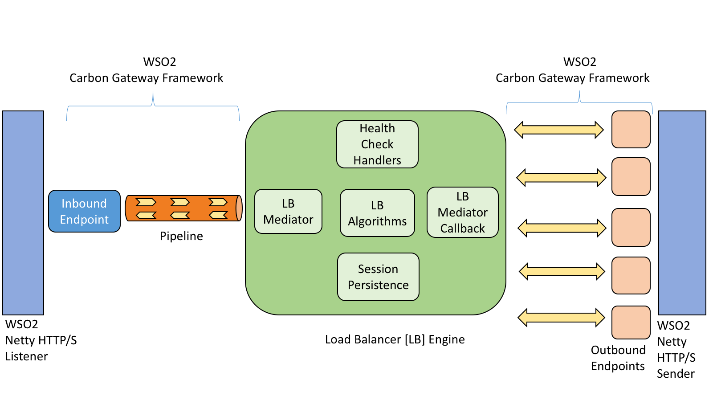

# HTTP Load Balancer On Top Of WSO2 Gateway
This is a Google Summer of Code (GSoC 2016) Project.  It is under development.

 `Abstract:` http://summerofcode.withgoogle.com/projects/#6175096838291456

 `Proposal:` http://docs.google.com/document/d/1Agl-Y_UKM5eMon8IDZa02aDGj0Yh_vZ7kFC2b1IzFI4/edit?usp=sharing
 
 `Mid Term :` https://docs.google.com/document/d/1kEk706KkwjK3gFpjx56vNwAKzVQpa-G52MHIC_I7-0Y/edit?usp=sharing
 
Architecture
------------

<br/>
<b>High Level Architecture</b>

![alt tag] (docs/High Level Architecture.PNG)


<br/>
<b>Engine Architecture</b>



<br/>
<b>Message Flow</b>


Performance Benchmarks
----------------------
In this performance test, five instances of simple service created using Netty framework were used.  Each instance is a fast backend (0s delay) with response of size 1KB.

**One Million(1,000,000) requests** were sent at different **concurrency levels (500 to 12,000)** to Netty backend, Nginx and GW-LB using apache bench via this [automated script] (performance-benchmark/excecute-tests.sh).

More details can be found [here](performance-benchmark).

<br/>
<b>Throughput Test</b>

Tests were done twice.  Average of 'Average throughput' for each concurrency level is calculated and plotted.  

First graph shows throughput comparision between Open Source Nginx and GW-LB.  Second graph shows throughput comparision with Netty backend.

![Throughput] (performance-benchmark/graphs/throughput_without_netty.png)

![ThroughputWithNetty] (performance-benchmark/graphs/throughput_with_netty.png)

<br/>
<b>Latency Test</b>

Tests were done twice.  Average of 'Mean Latency' for each concurrency level is calculated and plotted.

![MeanLatency] (performance-benchmark/graphs/mean_latency.png)

<br/>
<b>Memory Test</b>

Java Flight Recorder (JFR) is enabled while starting LB server and recording is stopped after load test ends.  The obtained JFR recording has memory usage details.

This graph shows **Committed, Reserved and Used Heap** values.

![UsedMemory] (performance-benchmark/graphs/memory_using_jfr.png)


Building Product
----------------

- Clone and do `mvn install` on https://github.com/wso2/carbon-gateway-framework.git as this product
  is dependent on it.

- Then do `mvn install` on this product.

- Now Clone and do `mvn install` on https://github.com/Venkat2811/carbon-gateway-framework.git as it 
  has support for LB.

- Again do `mvn install` on this product.

- Goto `<CARBON_HOME>\product-http-load-balancer\product\target\` and 
  extract `wso2gwlbserver-1.0.0-SNAPSHOT.zip`.

- Then goto `<CARBON_HOME>\product-http-load-balancer\product\target\wso2gwlbserver-1.0.0-SNAPSHOT\wso2gwlbserver-1.0.0-SNAPSHOT\bin` and start `carbon.bat` or `carbon.sh` accordingly. 


Sample Configuration
--------------------

```
@startuml

participant StocksInbound : InboundEndpoint(protocol("http"),port("8290"),context("/stocks"))

participant StocksPipeline : Pipeline("Stocks_Flow")

participant Endpoint1 : OutboundEndpoint(protocol("http"),host("http://localhost:8080/stockquote/all"))

participant Endpoint2 : OutboundEndpoint(protocol("http"),host("http://localhost:8082/stockquote/all"))

participant Endpoint3 : OutboundEndpoint(protocol("http"),host("http://localhost:8084/stockquote/all"))

participant Endpoint4 : OutboundEndpoint(protocol("http"),host("http://localhost:8086/stockquote/all"))

participant Endpoint5 : OutboundEndpoint(protocol("http"),host("http://localhost:8088/stockquote/all"))

StocksInbound -> StocksPipeline : "client request"

LoadBalancer(algorithm(name(ROUND_ROBIN)),persistence(type(NO_PERSISTENCE)),healthCheck(type(PASSIVE),requestTimeout(5s),unHealthyRetries(2times),healthyRetries(3times),healthyCheckInterval(1m)))

StocksPipeline -> StocksInbound : "Final Response"

@enduml

```

More Samples
------------

You can find more samples in `/product/carbon-home/samples/`.


Traffic Flows
-------------

#### Simple HTTP
Traffic between `Client -> LB -> Back-End` and `Back-End -> LB -> Client` are un-encrypted.


#### SSL Offload
 - Traffic from `Client -> LB` and `LB -> Client` are encrypted.
 - Traffic from `LB -> Back-End` and `Back-End -> LB` are un-encrypted.


#### SSL Re-Encryption
Traffic between `Client -> LB -> Back-End` and `Back-End -> LB -> Client` are encrypted.


